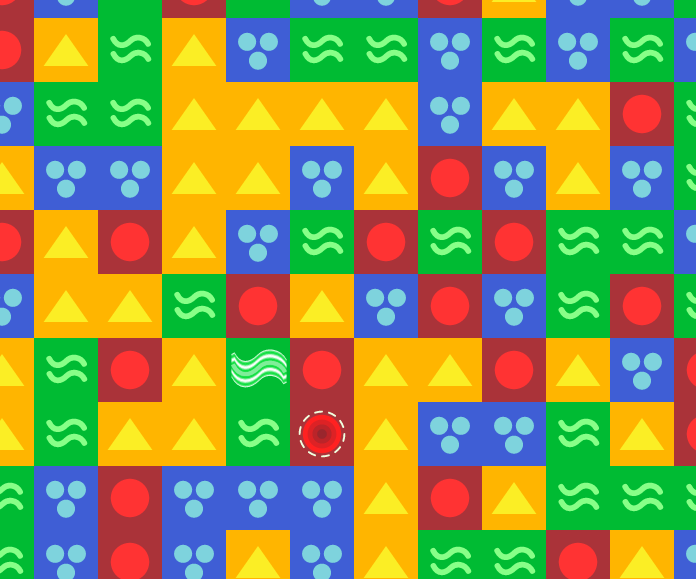
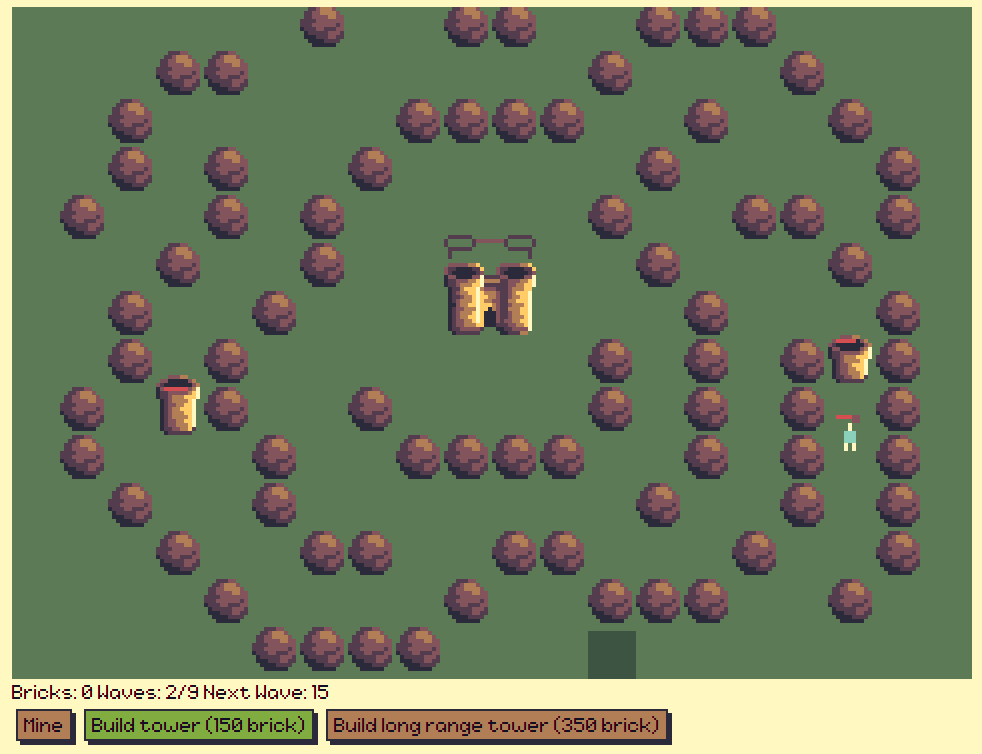
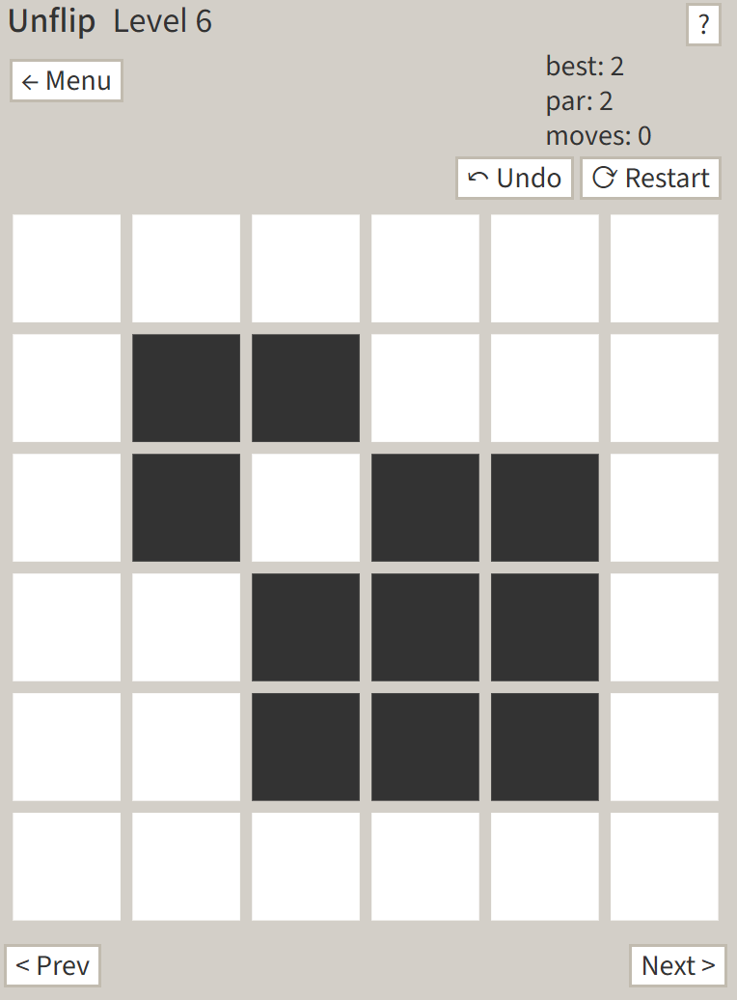
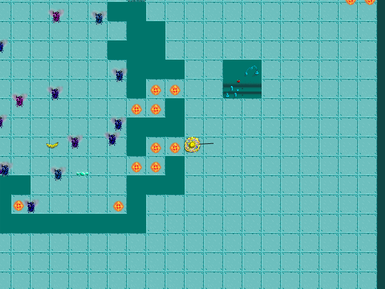
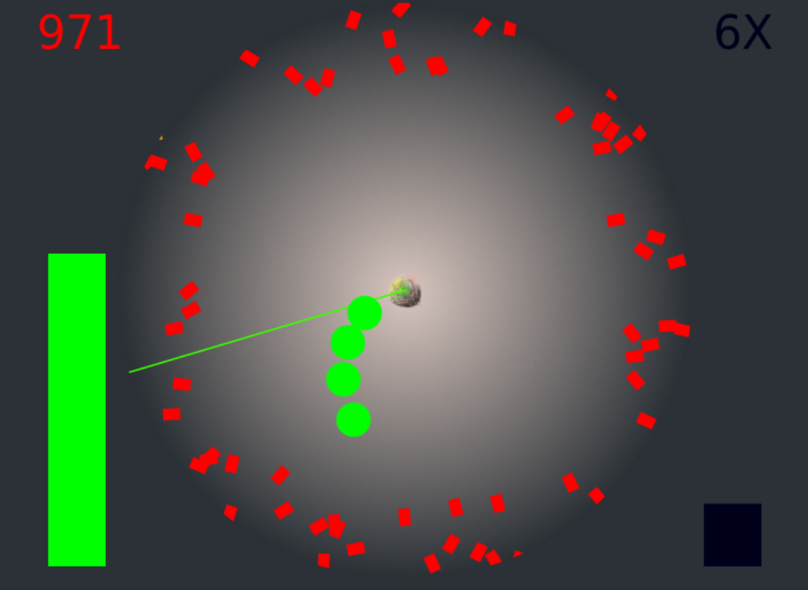

# [My HTML5 Games/Demos](https://paul-andre.github.io/HTML5-Games/)

## Colors Popper!

[Play Now!](https://paul-andre.github.io/ShapesPopper/publicMin/)

[Repo](https://github.com/Paul-Andre/ShapesPopper)

## Sacrifice Walls

[Play Now!](https://paul-andre.github.io/sacrifice-walls/)

[Repo](https://github.com/Paul-Andre/sacrifice-walls)

## Unflip/Unsquare

[Play Now!](https://unflipgame.com/)

## Fly Piñata

[Play Now!](https://paul-andre.github.io/LD24/)

[Repo](https://github.com/Paul-Andre/LD24)

## SpinTurret

[Play Now!](https://paul-andre.github.io/spinTurret/)

[Repo](https://github.com/Paul-Andre/spinTurret)

## Sacrifice Walls

[Play Now!](https://paul-andre.github.io/sacrifice-walls/)

[Repo](https://github.com/Paul-Andre/sacrifice-walls)

